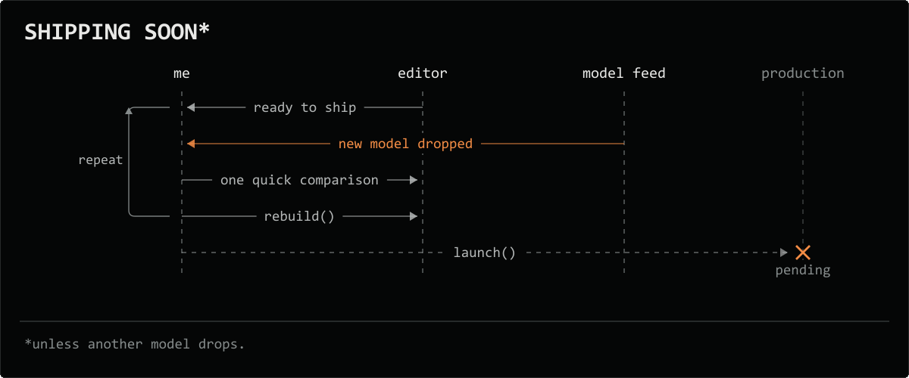
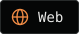
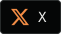
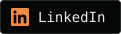
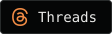
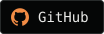
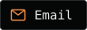
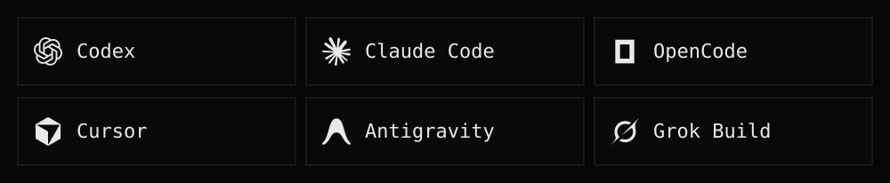
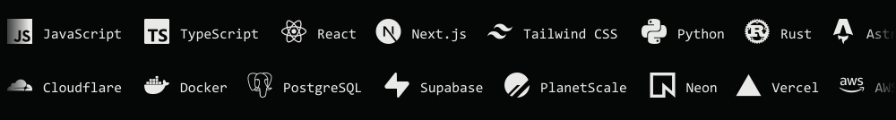
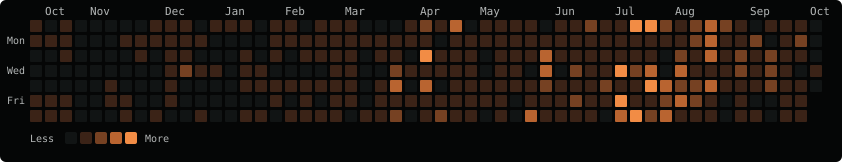

<a href="https://arifurrahman.dev">
  <picture>
    <source media="(max-width: 600px) and (prefers-reduced-motion: reduce)" srcset="assets/github/shipping-soon-loop-mobile.svg">
    <source media="(prefers-reduced-motion: reduce)" srcset="assets/github/shipping-soon-loop.svg">
    <source media="(max-width: 600px)" srcset="assets/github/shipping-soon-loop-mobile.gif">
    
  </picture>
</a>

  
  
  
  
  
  

### Daily drivers

Six assistants. One person saying “Wait, that’s not what I me—”

<picture>
  <source media="(max-width: 600px)" srcset="assets/github/crew-dark-mobile.svg">
  
</picture>

### Stack

<picture>
  <source media="(max-width: 600px) and (prefers-reduced-motion: reduce)" srcset="assets/github/stack-dark-mobile.svg">
  <source media="(prefers-reduced-motion: reduce)" srcset="assets/github/stack-dark.svg">
  <source media="(max-width: 600px)" srcset="assets/github/stack-dark-mobile.gif">
  
</picture>

### GitHub

  

